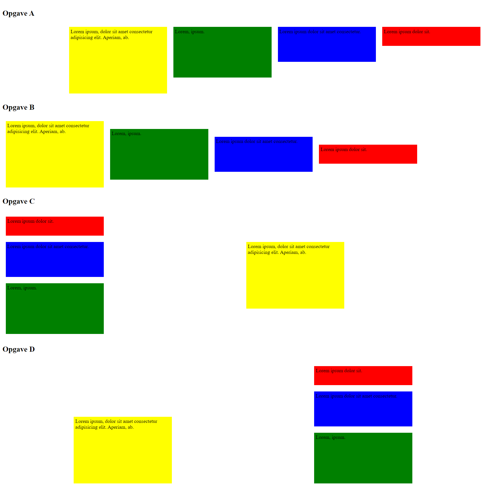

# Oefenreeks 05: Flexbox

Voer volgende stappen uit met een editor naar keuze.

* Maak een nieuwe webpagina en noem deze **index.html**
* Voeg een titel toe aan je webpagina **Flexbox**
* Koppel een stylesheet aan je pagina en zorg ervoor dat deze in een passende folder binnen je uitwerking zit.

* Onze webpagina zal uit 4 delen bestaan. Ieder deel bestaat uit een **h2** element gevolgd door de volgende html code.

```html
<div class="outer">
    <div class="first">Lorem ipsum dolor sit.</div>
    <div class="second">Lorem ipsum dolor sit amet consectetur.</div>
    <div class="third">Lorem, ipsum.</div>
    <div class="fourth">Lorem ipsum, dolor sit amet consectetur adipisicing elit. Aperiam, ab.</div>
</div>
```
* Plaats ieder deel in een gepast semantisch element en geef het gepaste ids
* Zorg ervoor dat div-elementen met als klasse *outer* flex-containers worden
* Stel de marge van alle flex-items in op 10px
* Stel de padding van alle flex-items in op 5px
* Stel de breedte van alle flex-items in op 300px
* Zorg voor de volgende stijlregels op de flex-items:
    * elementen met als klasse *first* krijgen een rode achtergrondkleur en een hoogte van 50px
    * elementen met als klasse *second* krijgen een blauwe achtergrondkleur en een hoogte van 100px
    * elementen met een klasse *third* krijgen een groene achtergrondkleur en een hoogte van 150px
    * elementen met een klasse *fourth* krijgen een gele achtergrondkleur en een hoogte van 200px
* Stel de hoogte van de derde en de vierde flex-container in op 400px
* Gebruik de verschillende flexbox properties om zo dicht mogelijk bij onderstaand resultaat te komen

